# Hybrid Azure Infrastructure Lab: AD + Monitoring + Azure Integration

This project simulates a real-world hybrid IT infrastructure, integrating on-premises Active Directory with Microsoft Entra ID (Azure AD), and showcasing user management, GPO implementation, Azure VM monitoring, backup, and Azure user delegation.

---

## 🔧 Infrastructure Overview

- Windows Server VM (Terraform provisioned)
- AD DS role enabled to promote to Domain Controller
- GPOs for IT/HR/Finance OU policies
- Azure AD sync for hybrid identity using Microsoft Entra Connect
- Monitoring & backup configured in Azure Portal

---

## ✅ Active Directory Setup

The Windows Server was configured as a Domain Controller for the `corp.local` domain.

### Promoting to Domain Controller
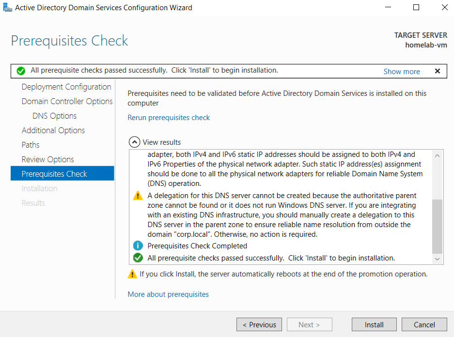
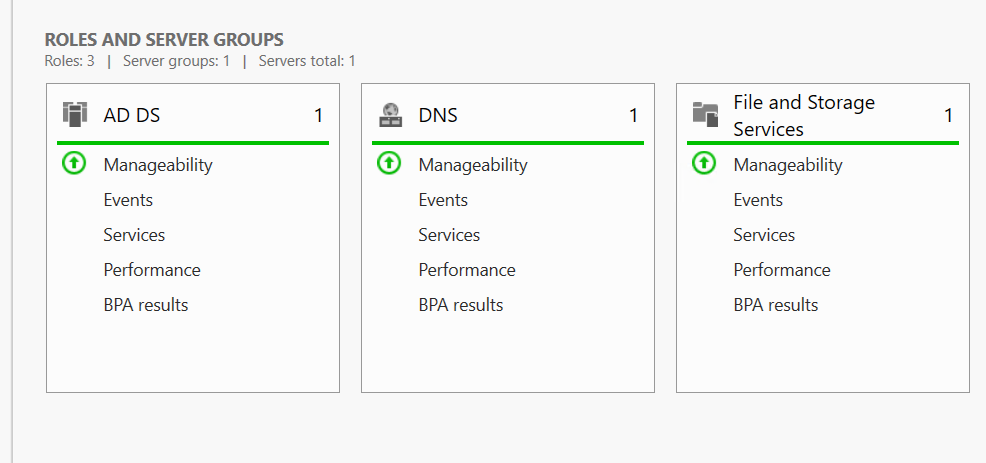

---

## 👥 Organizational Units and GPO

- Created OUs: IT, HR, Finance, and a dedicated `Azure Users` OU
- GPO applied:
  - IT group granted enhanced permissions
  - HR/Finance restricted from using cmd

### GPO Examples:
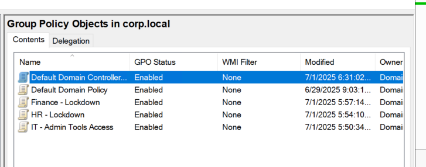
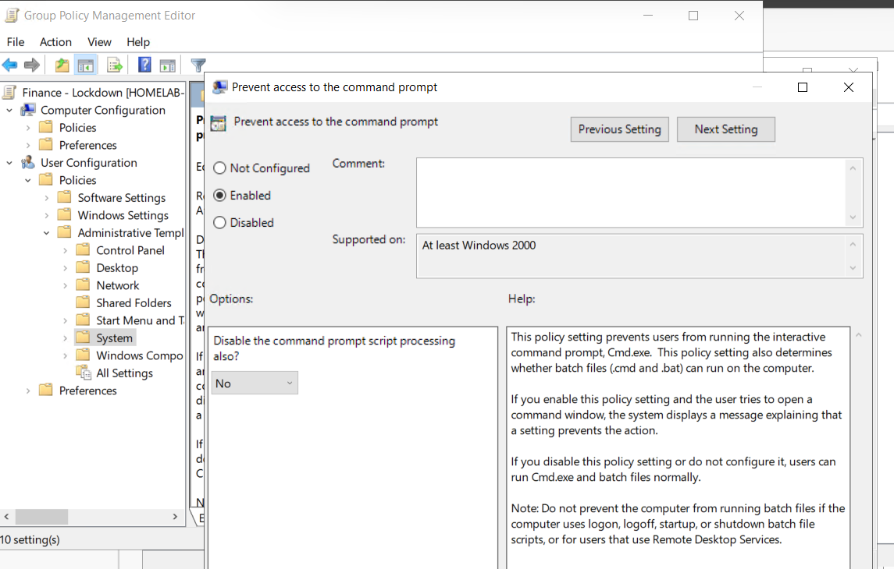
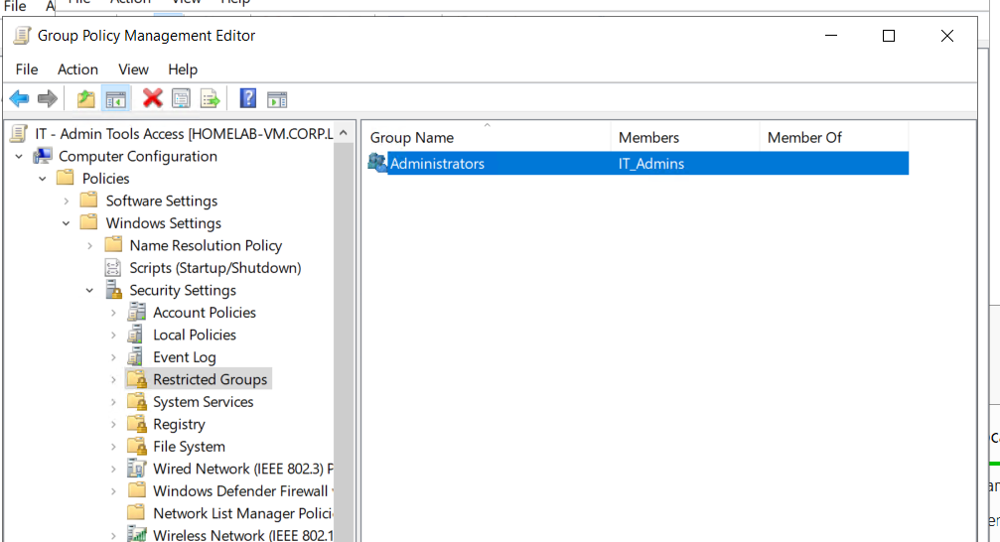

> ⚠️ Important: Ensure the `labadmin` user remains in the **Administrators** group or you will lose access via RDP.  
> This was fixed using:
> ```bash
> net localgroup Administrators labadmin /add
> ```

---

## 🔁 Azure AD Sync (Microsoft Entra Connect)

- Created a new user `az_Harvey.Smith` under a special OU
- UPN was updated to match Azure domain (`@harveyaland99outlook.onmicrosoft.com`)
- Entra Connect re-run and filtered to only sync the `Azure Users` OU

### Steps and Verification:

**1. Added UPN Suffix in AD Domains and Trusts**
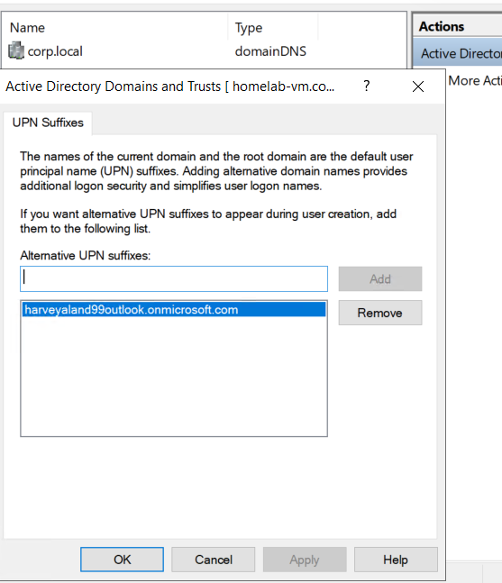

**2. Created User**
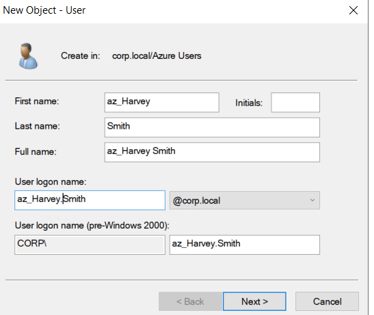

**3. Changed UPN**
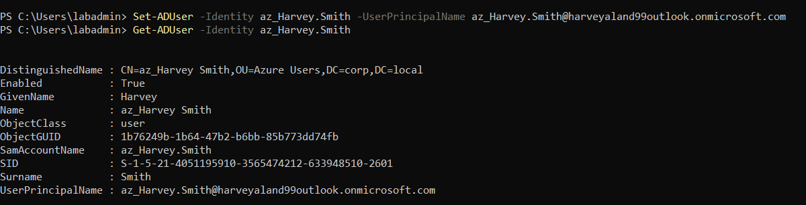

**4. Filtered OU in Entra Connect**
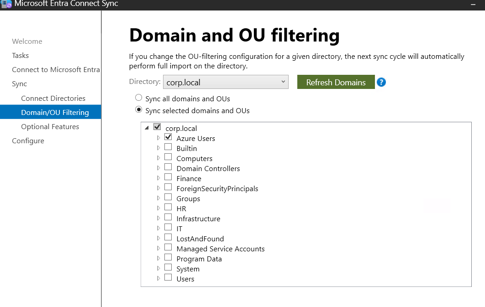

**5. Re-synced & Verified**
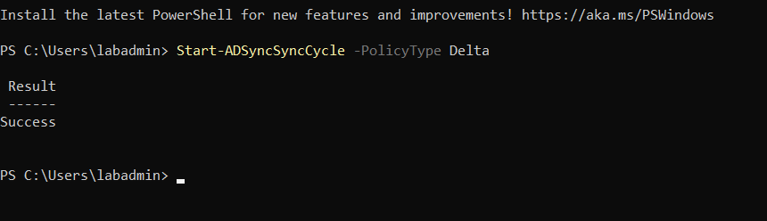
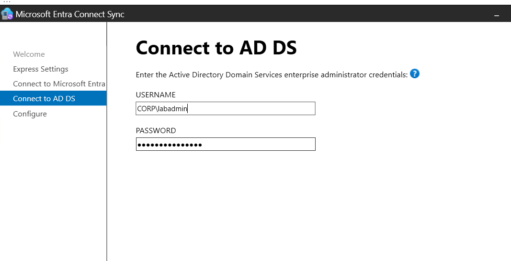
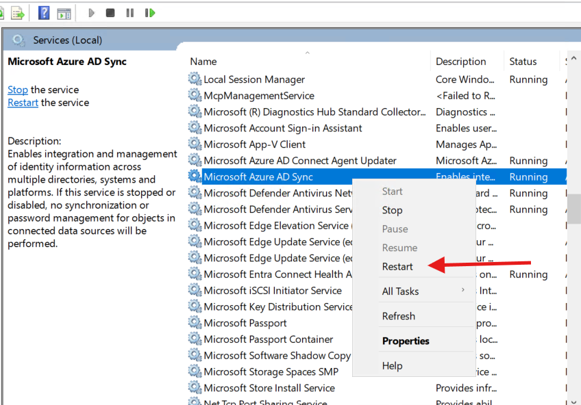
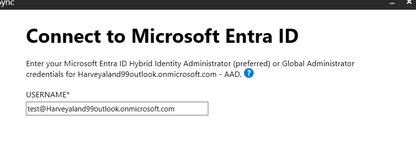

---

## ☁️ Azure Access and Portal Login

The synced Azure user was granted **Contributor** rights to the subscription and successfully signed into the Azure Portal.

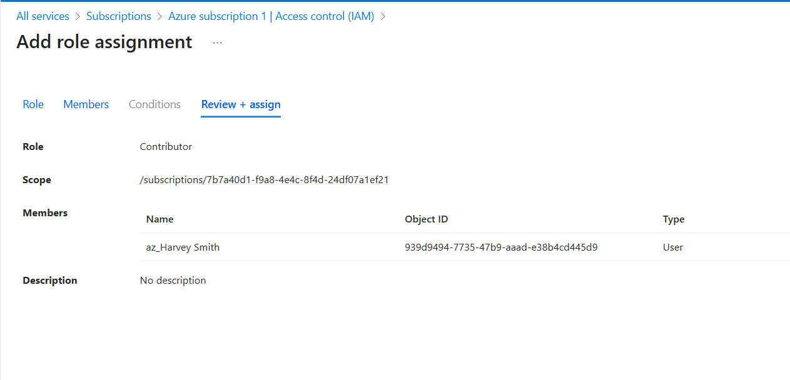
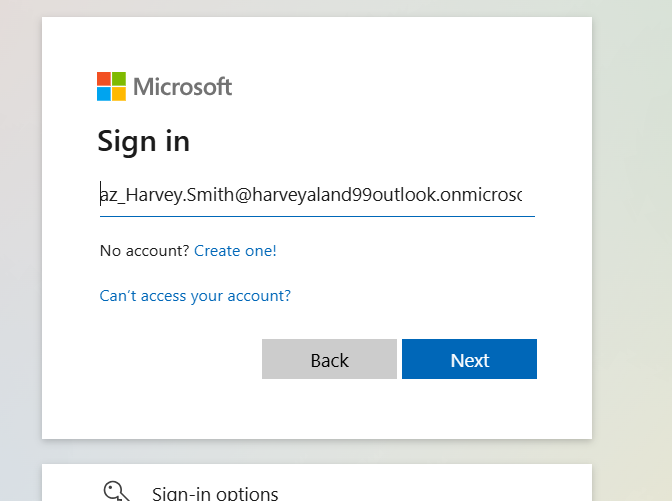
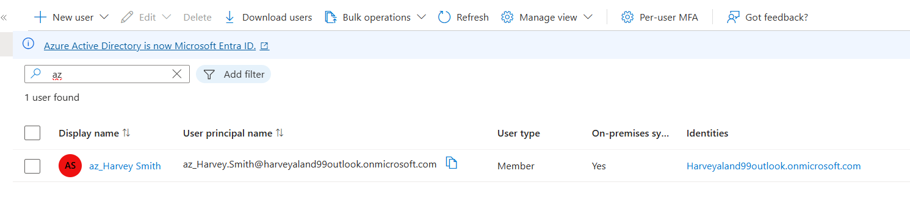

---

## 📊 VM Monitoring

Monitoring was enabled using Azure Monitor & a custom log workspace.

- Created log workspace: `homelab-logs`
- Enabled data collection
- Verified CPU utilization from portal

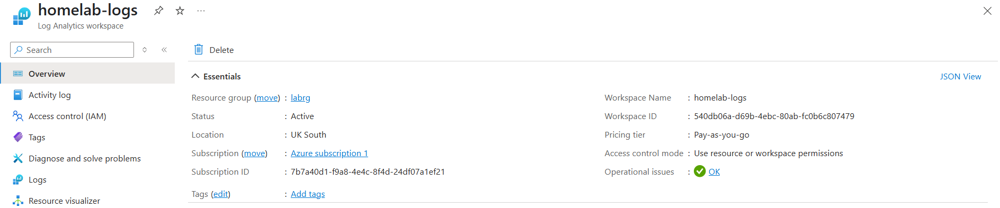
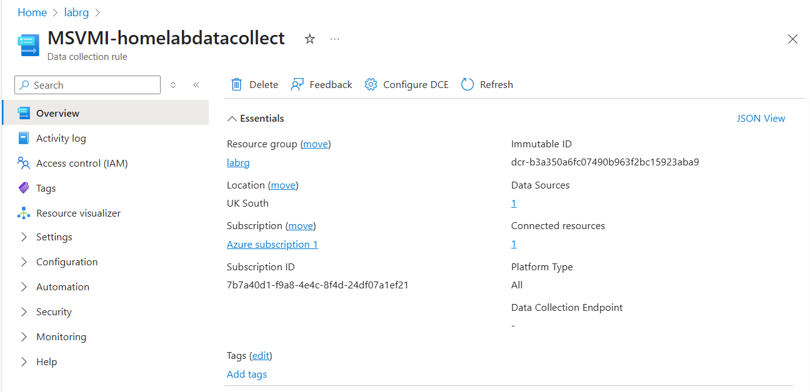
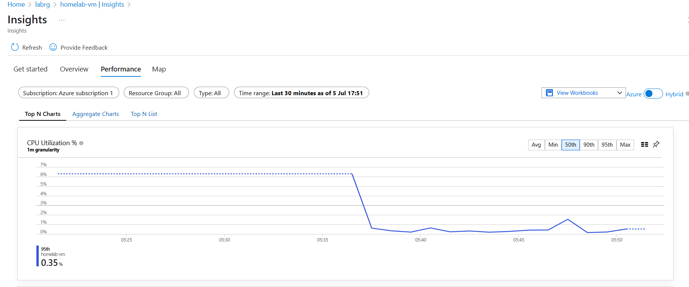

---

## 🔐 VM Backup

Backup was configured via Recovery Services Vault for the domain controller.

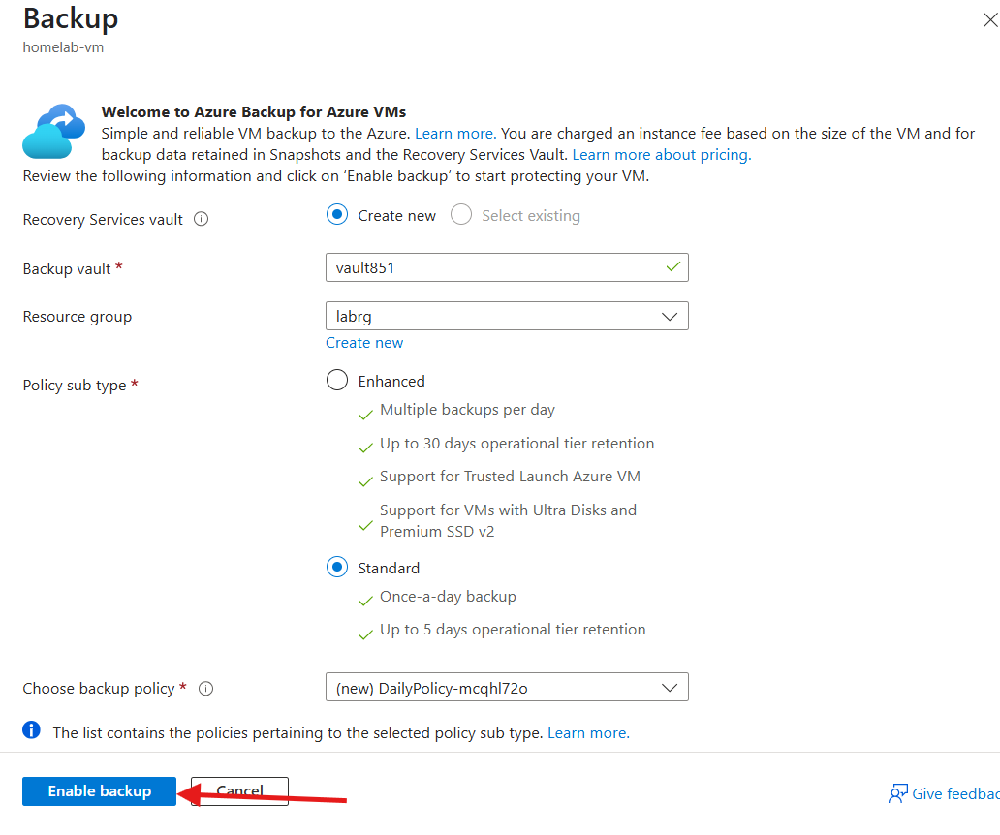
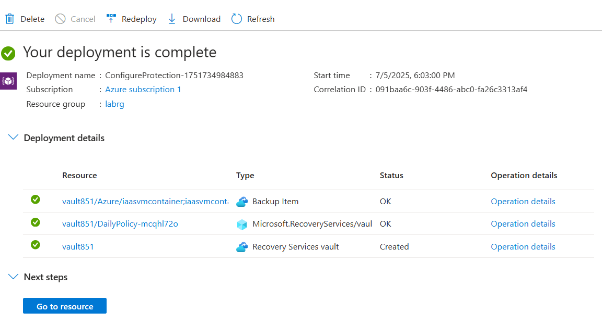

---

## 🧪 GPO Testing (Non-Command Line User)

Logged in as `psmith` (HR) to verify command prompt lockdown worked.

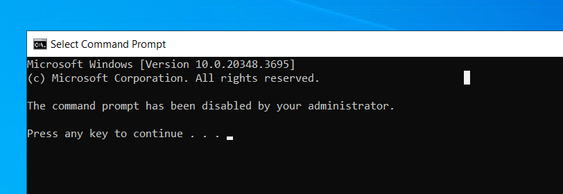

> 💡 `gpupdate /force` was run and GPO applied.

---

## 💡 Additional Notes

- UPN was kept different intentionally to match Azure-enforced domain requirements.
- A dedicated OU was used to scope sync and simulate enterprise structure.
- Troubleshooting Entra Sync heartbeat involved restarting service and verifying sync rules.
- All infra deployed via Terraform; monitoring and backup done via Azure Portal.

---

## 🧵 Summary

This project proves the ability to integrate on-premises Windows Server environments with cloud-native Azure tools like Entra ID, Monitor, and Backup. The hybrid design reflects real enterprise infrastructure with scoped identity sync and security controls.

