# 🌐 Hybrid Azure Infrastructure Lab: AD + Monitoring + Azure Integration

This project simulates a real-world hybrid IT infrastructure by integrating on-premises Active Directory with Microsoft Entra ID (Azure AD). It demonstrates identity federation, GPO enforcement, Azure VM monitoring, secure backup, and delegated Azure access — built as a proof-of-concept for enterprise hybrid setups.

---

## ✅ Project Overview

- Windows Server VM provisioned via **Terraform**
- AD DS promoted to **Domain Controller (corp.local)**
- **GPOs** created and scoped to OU-specific policy requirements
- Azure AD (Entra ID) **hybrid identity sync** with scoped OU
- **Azure Monitor** and **Azure Backup** configured for observability and protection
- One synced user granted delegated access to Azure resources

---

## 🔧 Infrastructure Deployment via Terraform

The base infrastructure (VM, networking) was provisioned using Terraform. The `.tfvars` file was **excluded from GitHub** using `.gitignore` as it contains sensitive values (e.g., admin credentials, region, names). This file allows customization without changing core `.tf` files.

> Example usage:
```bash
terraform apply -var-file="terraform.tfvars"
```

---

## 🧱 Domain Controller Setup

After deploying the VM:

1. Installed the **Active Directory Domain Services** (AD DS) role.
2. Promoted the VM to a **Domain Controller** with the domain `corp.local`.

**Installation Confirmation:**  
  

**Post-Installation Check:**  
  

---

## 🏢 Organizational Units & GPO Configuration

Created the following Organizational Units (OUs):

- `IT`
- `HR`
- `Finance`
- `Azure Users` (created later for hybrid identity)

GPOs were assigned based on department policies:

- **HR & Finance** received a policy to disable CMD prompt.
- **IT** was granted **Local Administrator** access via GPO.

**GPO Overview:**  
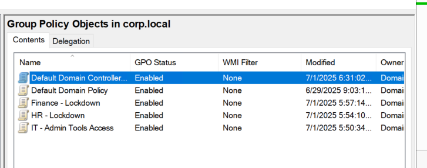

**Lockdown CMD Prompt (HR/Finance):**  
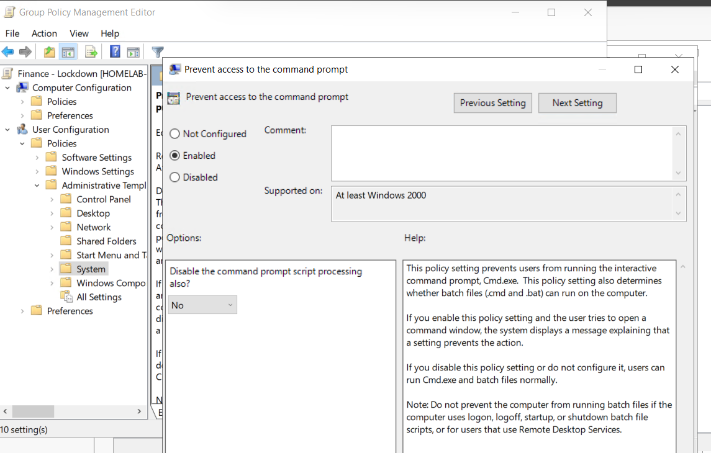

**Local Admin Access (IT):**  
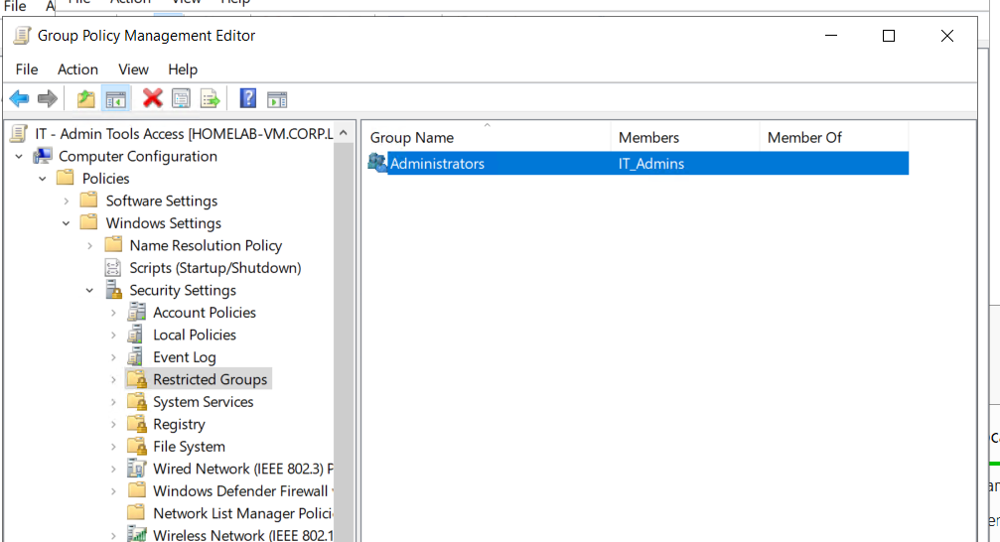

---

## 🧪 GPO Testing & User Access

To confirm GPO enforcement:

- Logged in as a restricted user from `HR` OU.
- Confirmed **Command Prompt was disabled**.
- Verified `IT` users had admin privileges.

**CMD Locked for HR User:**  
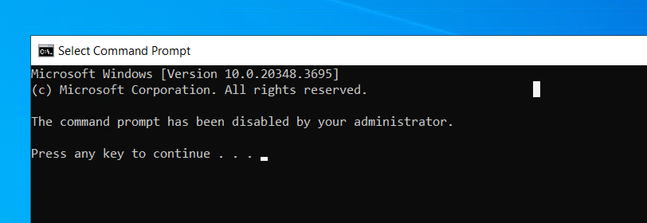

**Admin Access for IT (Policy Applied):**  
> *Verified through login + access testing, screenshots not shown.*

---

## 🔁 Hybrid Identity Sync (Azure AD Connect)

To integrate with Azure:

1. Added UPN suffix to support Azure sign-in (`harveyaland99outlook.onmicrosoft.com`)
2. Created a new **OU: Azure Users**
3. Created user: `az_Harvey.Smith` with UPN kept intentionally different (`az_harveysmith@harveyaland99outlook.onmicrosoft.com`)
4. Configured **Azure AD Connect** to sync **only this OU**.

> ❗ **Troubleshooting:** On first sync attempt, password sync failed. The sync was reconfigured and restarted.

**UPN Suffix Addition:**  
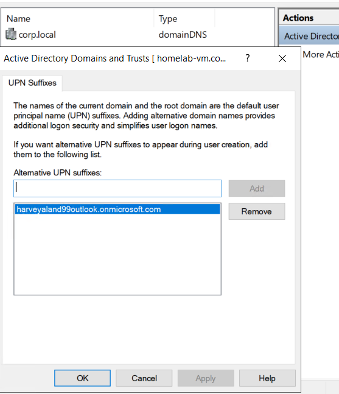

**Azure User Creation:**  
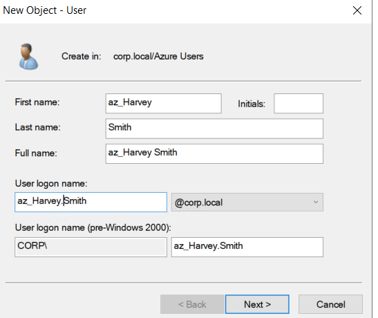

**Set Custom UPN:**  
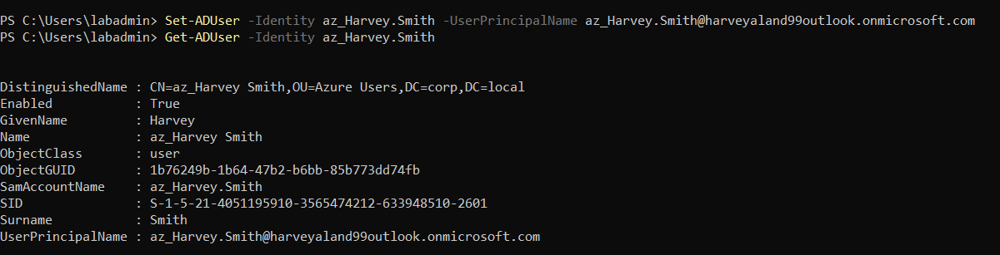

**Scoped OU Sync:**  
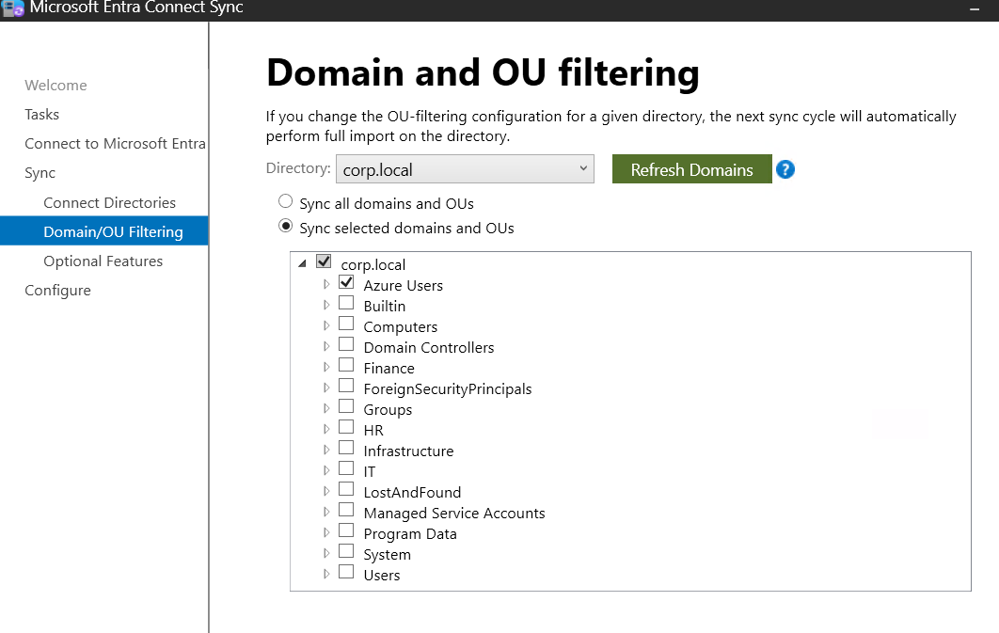

**Force Sync (PowerShell):**  
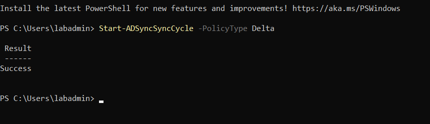

**Verify Sync in Entra:**  
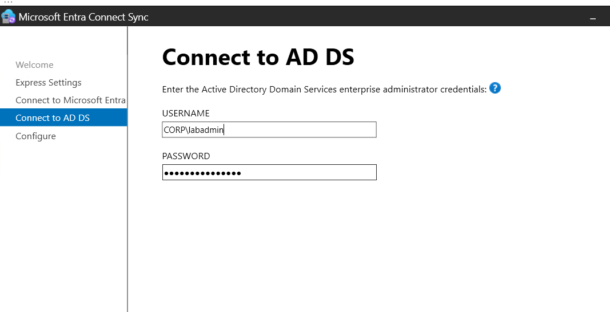

**Fixed Password Sync:**  
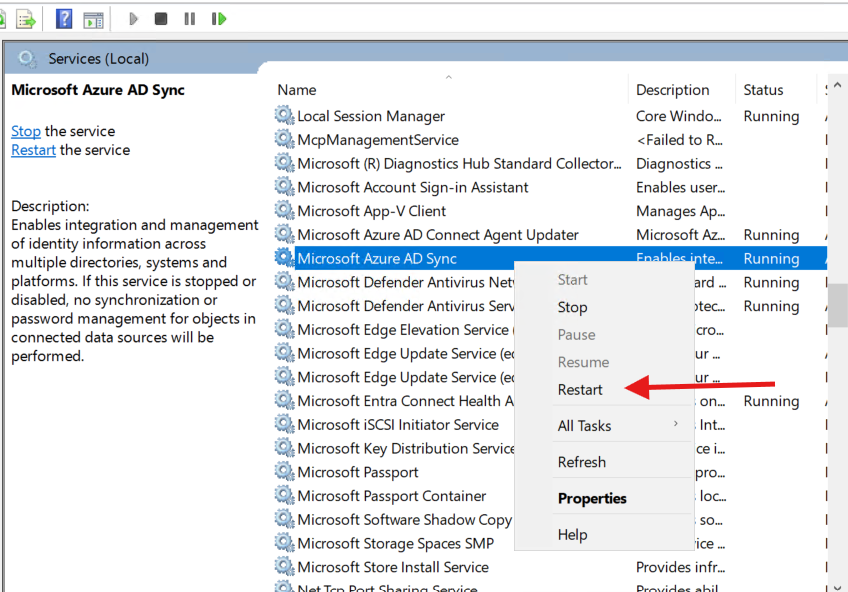

---

## 👤 Azure Portal Access (Synced User)

Once synced:

- The user was visible in Azure AD.
- Assigned the `Contributor` role.
- Logged into the **Azure Portal** successfully.

**Role Assignment:**  
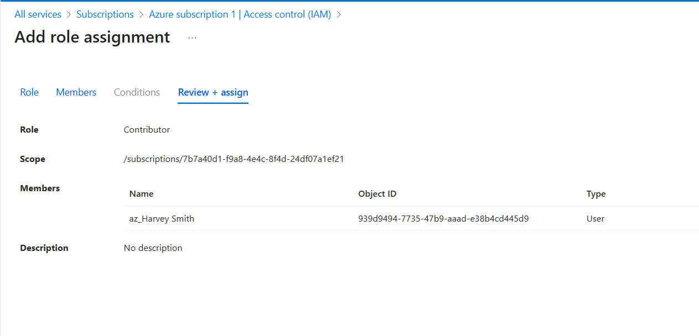

**Login Confirmation:**  
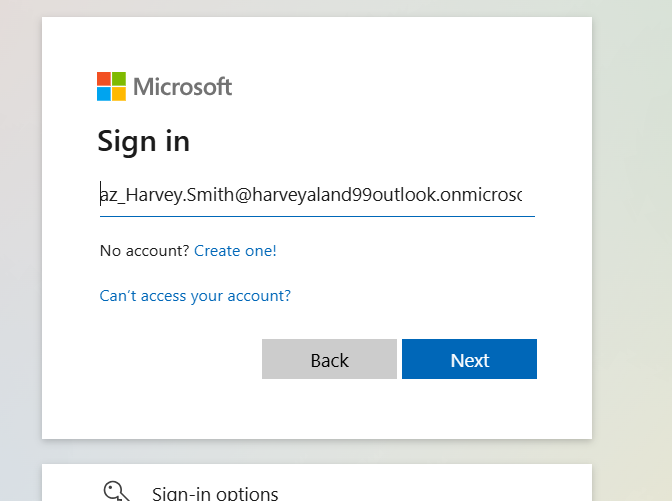

**Azure AD Presence Confirmed:**  
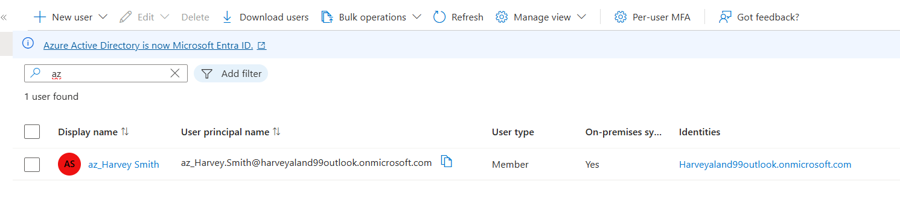

> ✅ **Note**: A custom OU helped enforce separation of synced users. Azure user login was validated and tested end-to-end.

---

## 🧪 GPO & Admin Lockout Avoidance

While securing GPOs for lockdown, care was taken to **add the `labadmin` account to the local administrators group**. This prevented accidental lockout from the VM during restrictive GPO testing.

---

## 📊 Monitoring the VM (Azure Monitor)

1. Created a new **Log Analytics workspace**
2. Set up a **data collection rule** for guest metrics
3. Linked VM to Insights and verified performance visibility

**Workspace Created:**  
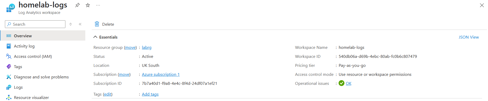

**Data Collection Rule:**  
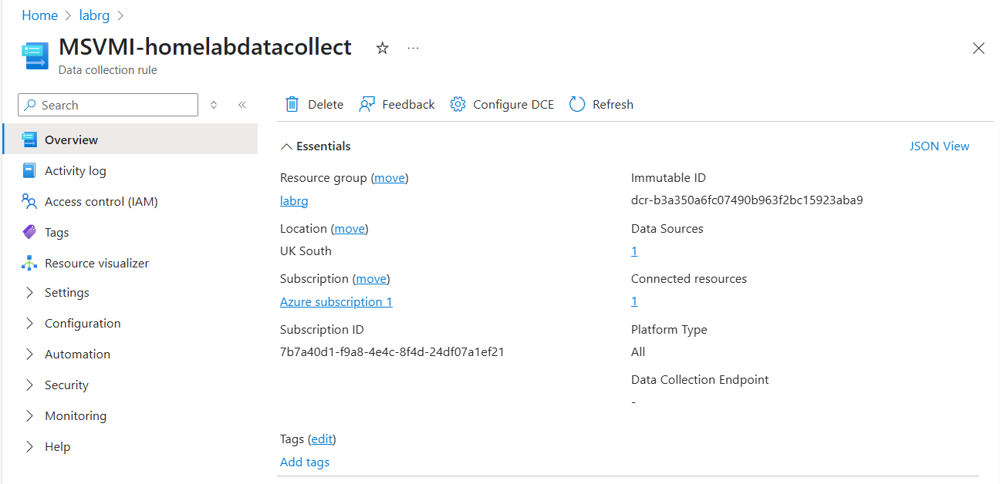

**CPU Utilization:**  
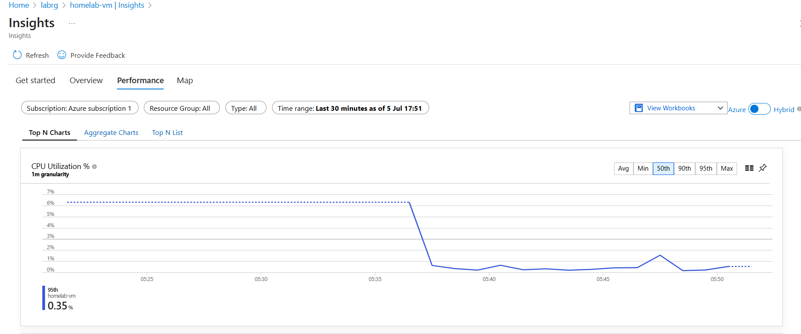

> ⚠️ If you only see a flatline, ensure the agent is installed and configured properly. Initial delay is normal post-activation.

---

## 💾 Azure Backup Configuration

1. Created a **Recovery Services Vault**
2. Applied the **Enhanced backup policy** with daily snapshot retention
3. Enabled protection for the VM

**Backup Setup:**  
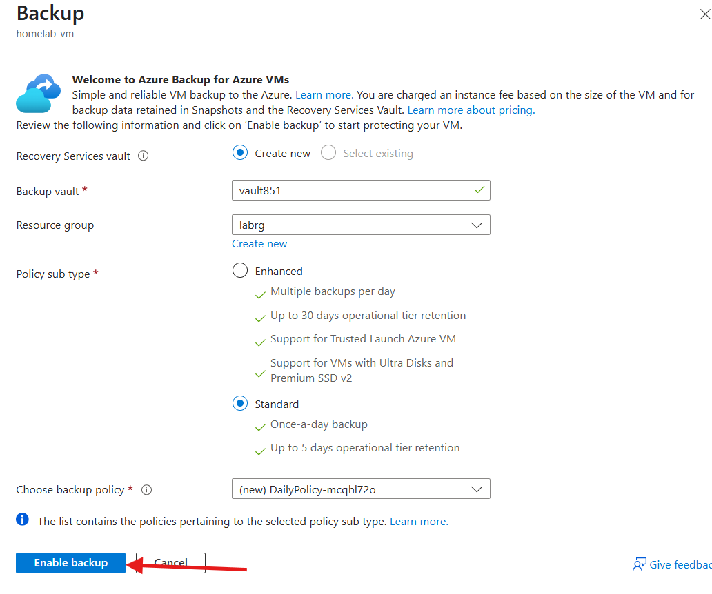

**Deployment Success:**  
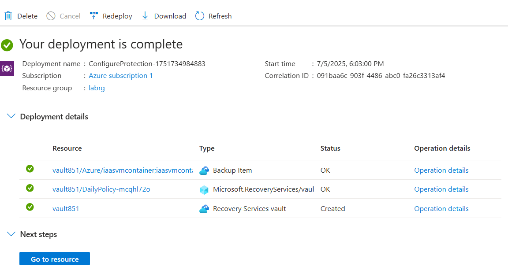

---

## 🧵 Summary

This hybrid Azure lab simulates core enterprise infrastructure:

- Realistic **OU and GPO segmentation**
- Securely scoped **hybrid identity**
- Delegated Azure access via synced AD accounts
- Automated **monitoring** and **backup**

Designed for **infrastructure engineers**, this lab reflects practical scenarios in hybrid environments with Terraform-based provisioning, minimal cost, and extensibility for DR or role-based access in future iterations.


